## Overview
MojiChatApp (fork) is a project that demonstrates the application of DevSecOps and Infrastructure as Code in modern software development workflows. Instead of focusing on building chat features, this fork emphasizes designing automated CI/CD pipelines, integrating security testing, and managing infrastructure with tools such as Terraform and Docker Swarm. The goal is to create a secure, scalable, and efficient deployment environment, showcasing how DevSecOps and IaC can enhance quality and operational effectiveness for any application.

## Web Development Technologies & Deployment Technologies

## Infrastructure Technologies & Automation Technologies

## 🏛️Interface
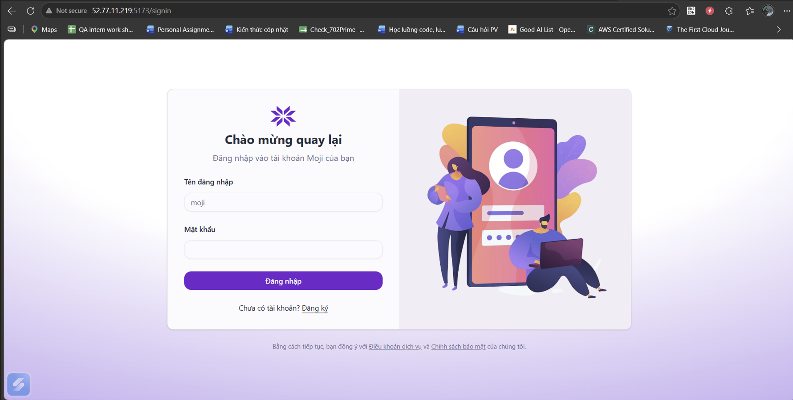
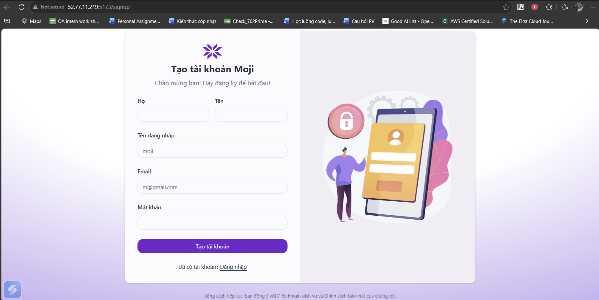
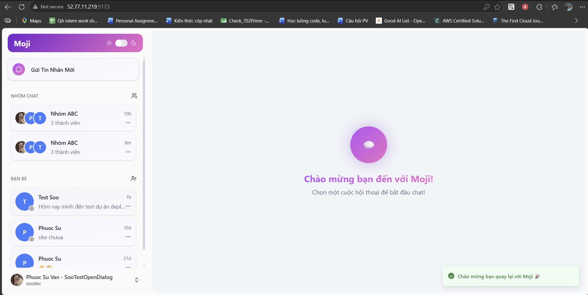

## 🏛️Infrastructure Architecture
- Development Architecture
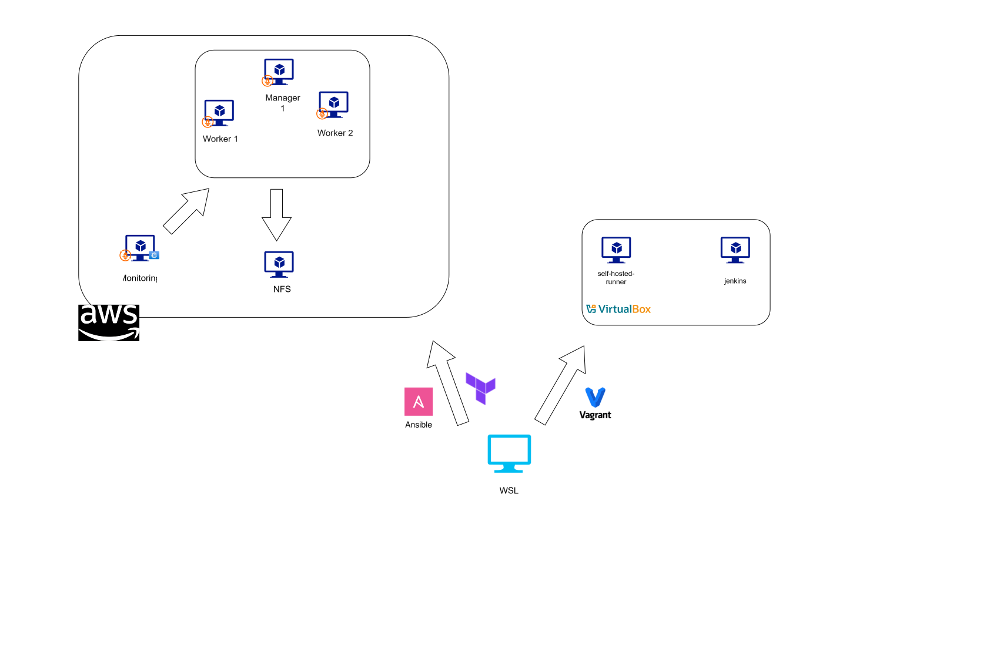
### Virtual Machine Specifications
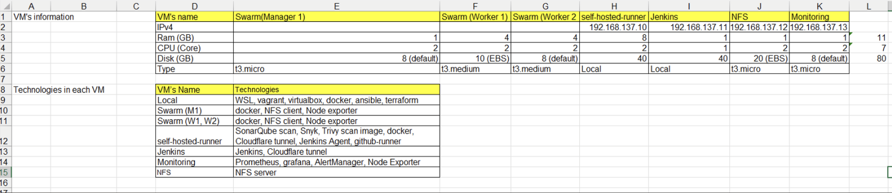
### Pipeline Jobs Specifications
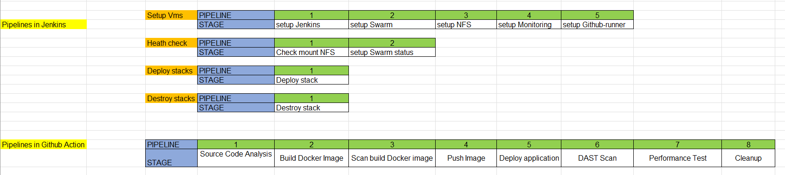
## Pipelines
### Jenkins jobs
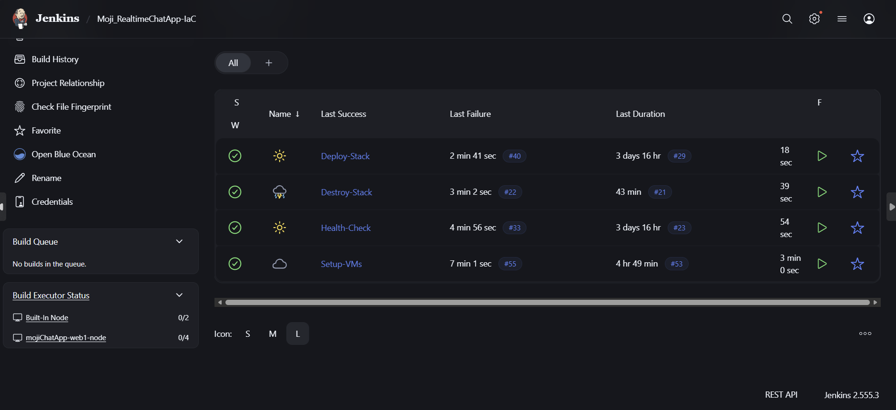
#### Deploy-stack
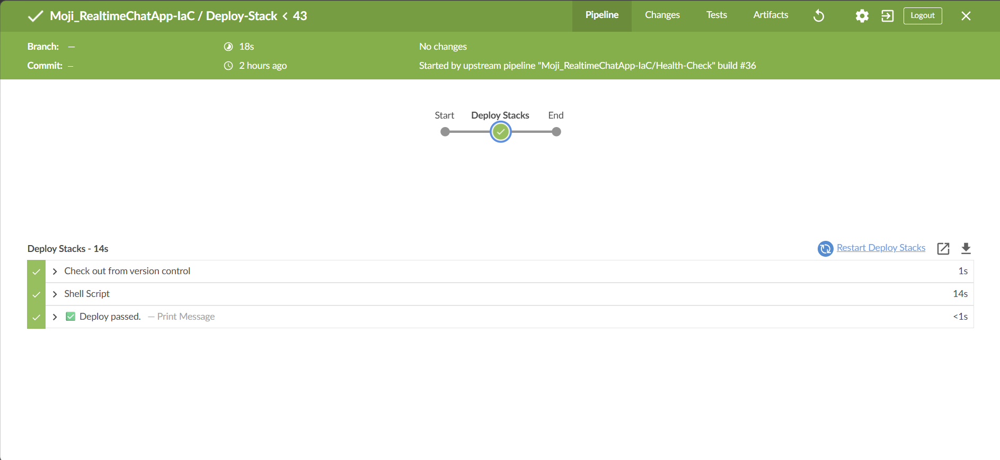
#### Destroy-stack
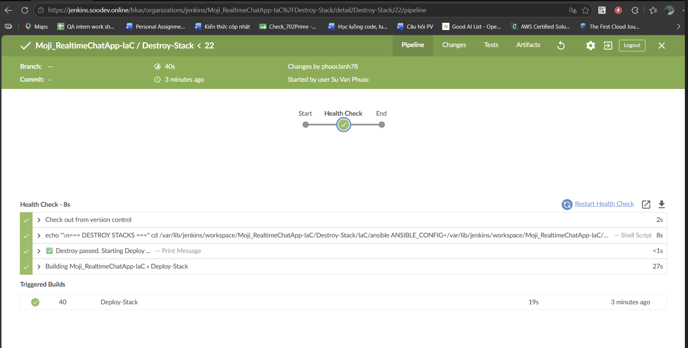
#### Health-check
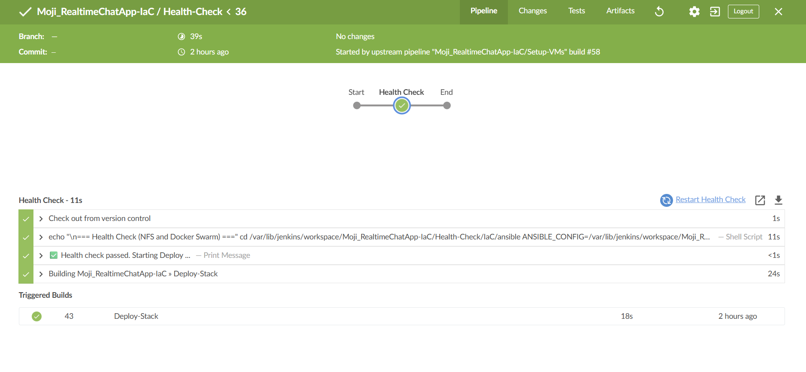
#### Setup VMs
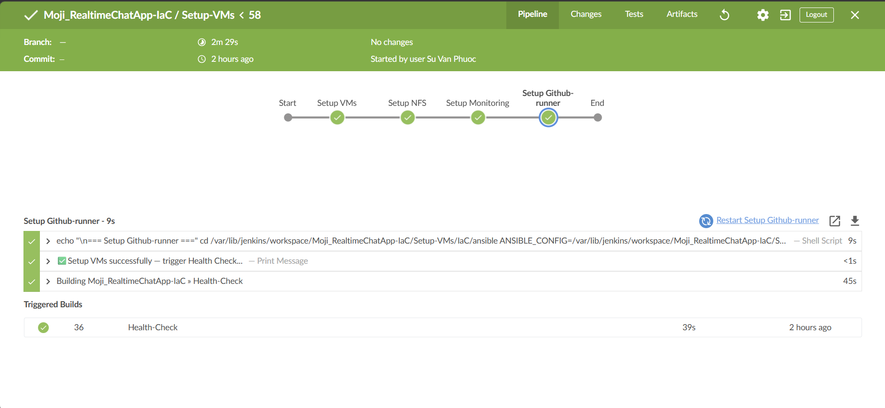
### Github Action jobs
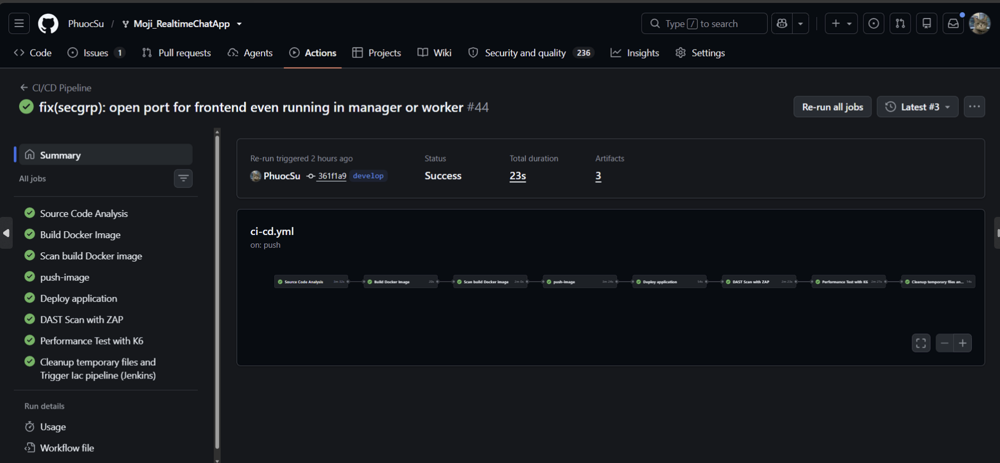
- With Code Quality scan, we can see in own sonarqube UI.
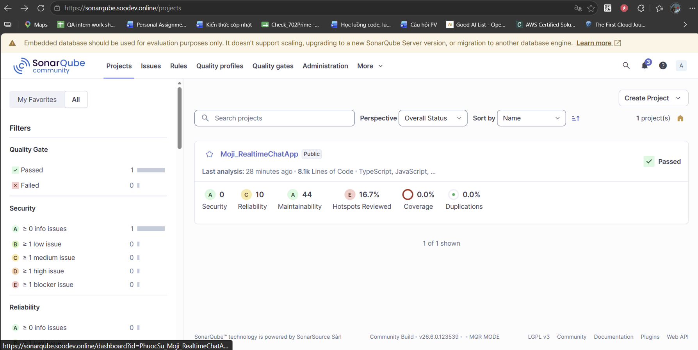
- For performance test (k6) and security scanning (ZAP), we can view the artifact results after Github pipeline finished.
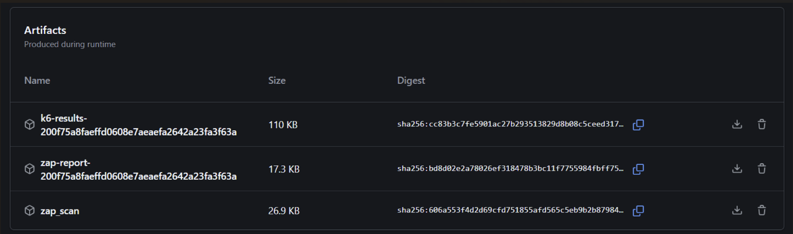
- In my repository, under Security and quality > Code scanning, we can view the results of image scans (Trivy) and dependency vulnerabilities scan (snyk).
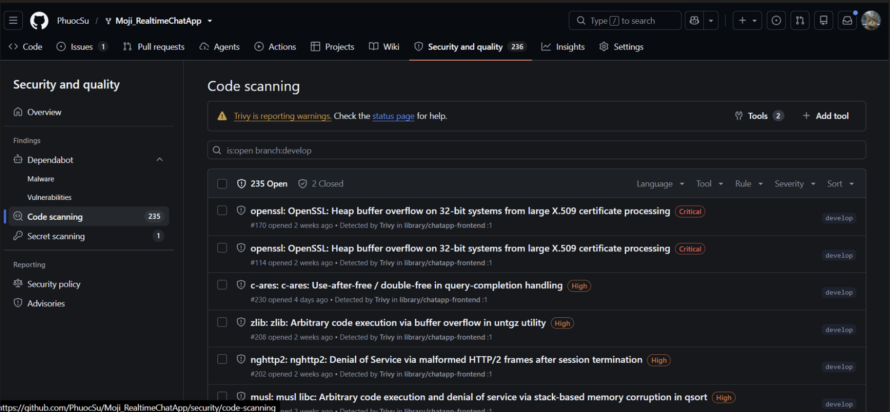
## ⏱️Monitoring
### Grafana
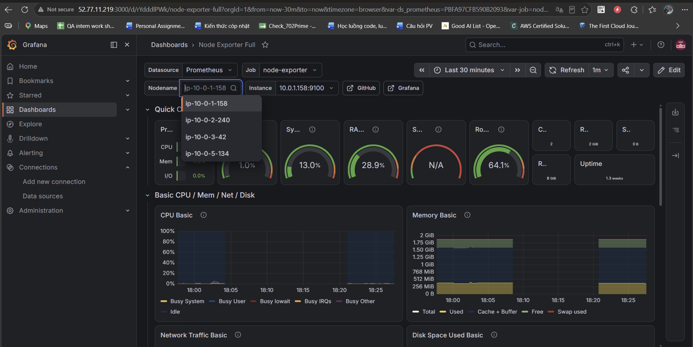
=> Grafana will monitor the manager node, swarm nodes, and the monitoring services.
### Prometheous
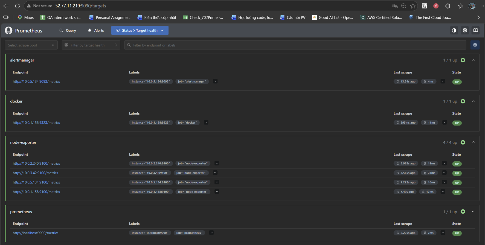
### Alert Manager
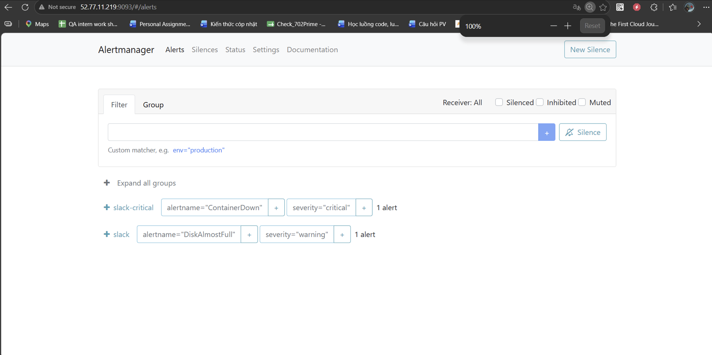
=> Then Alert Manager will trigger to Slack
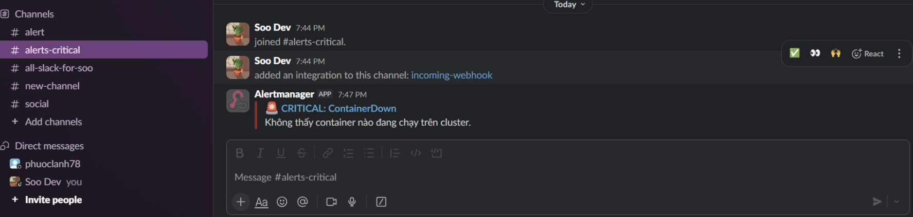
